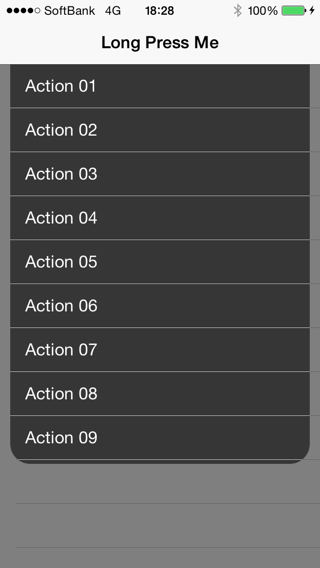
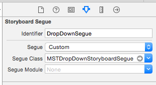

MSTDropDownPresentationController
====================

[](https://travis-ci.org/Masahiko Tsujita/MSTDropDownPresentationController)
[](http://cocoadocs.org/docsets/MSTDropDownPresentationController)
[](http://cocoadocs.org/docsets/MSTDropDownPresentationController)
[](http://cocoadocs.org/docsets/MSTDropDownPresentationController)

##Overview
A Drop Down Presentation Controller like [Tweetbot 3](http://tapbots.com/software/tweetbot/)'s Timeline/Lists switcher.



## Requirements
iOS 8 & iOS SDK 8.0 and later.
## Installation

MSTDropDownPresentationController is available through [CocoaPods](http://cocoapods.org). To install
it, simply add the following line to your Podfile:

```ruby
pod "MSTDropDownPresentationController"
```

## Usage
### Using UIViewControllerTransitioningDelegate
First, adopt UIViewControllerTransitioningDelegate
```objective-c
- (UIPresentationController *)presentationControllerForPresentedViewController:(UIViewController *)presented presentingViewController:(UIViewController *)presenting sourceViewController:(UIViewController *)source {
    return [[MSTDropDownPresentationController alloc] initWithPresentedViewController:presented presentingViewController:presenting];
}

- (id <UIViewControllerAnimatedTransitioning>)animationControllerForPresentedController:(UIViewController *)presented presentingController:(UIViewController *)presenting sourceController:(UIViewController *)source {
    return [[MSTDropDownAnimationController alloc] init];
}

- (id <UIViewControllerAnimatedTransitioning>)animationControllerForDismissedController:(UIViewController *)dismissed {
    return [[MSTDropDownAnimationController alloc] init];
}
```
Second, present view controller with custom presentation
```objective-c
viewController.modalPresentationStyle = UIModalPresentationCustom;
viewController.transitioningDelegate = self;
[self presentViewController:viewController animated:YES completion:NULL];
```
### Or, You can get simply Delegate Object as follows:
```objective-c
viewController.transitioningDelegate = self.mst_dropDownTransitioningDelegate;
```
### Or, You can also use Custom Storyboard Segue Class
Select "Custom" Segue and specify `MSTDropDownStoryboardSegue` for Segue Class.



## License

MSTDropDownPresentationController is available under the MIT license. See the LICENSE file for more info.

